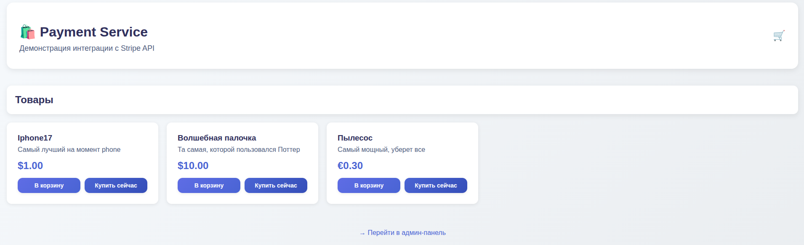
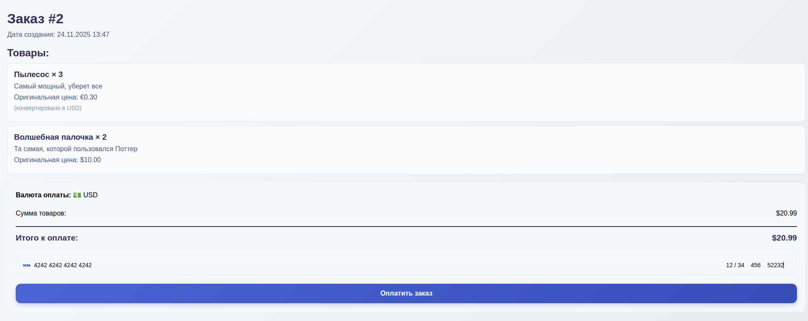
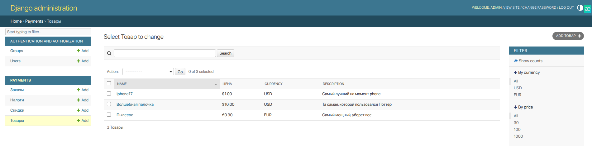

# Payment Service

Сервис для приема платежей через Stripe. Можно продавать товары, собирать их в корзину, применять скидки и налоги.

## Запуск

### Development (Docker)

```bash
cp .env.sample .env
# Отредактируйте .env - добавьте ключи Stripe
docker-compose up --build
```

Создайте суперпользователя:

```bash
docker-compose exec web python manage.py createsuperuser
```

Откройте http://localhost:8000

### Production (Docker + nginx)

```bash
cp .env.sample .env
# Настройте production переменные в .env
docker-compose -f docker-compose.prod.yml up -d --build
docker-compose -f docker-compose.prod.yml exec web python manage.py createsuperuser
```

## Без Docker

Если Docker не нужен, используйте [uv](https://docs.astral.sh/uv/):

```bash
uv sync
source .venv/bin/activate
python manage.py migrate
python manage.py createsuperuser
python manage.py runserver
```

## Настройка

В `.env` нужно указать ключи Stripe и настройки БД:

```env
STRIPE_PUBLIC_KEY=pk_test_...
STRIPE_SECRET_KEY=sk_test_...

DB_NAME=stripe_payment
DB_USER=postgres
DB_PASSWORD=your_password
DB_HOST=localhost
DB_PORT=5433
```

Пример в `.env.sample`.

## Как работает

Заходите на главную, видите список товаров. Можно купить сразу или добавить в корзину. В админке создаете товары, скидки, налоги. При оплате всё передается в Stripe через Payment Intent API.







## API

```
GET  /                              - главная страница со списком товаров
GET  /order/{id}/                   - детали заказа
GET  /buy-order/{id}/               - создать платеж для заказа
GET  /cart/                         - корзина
POST /cart/add/{id}/                - добавить товар в корзину
POST /cart/remove/{id}/             - удалить товар из корзины
POST /cart/update/{id}/{action}/    - изменить количество (increase/decrease)
POST /buy-now/{id}/                 - купить товар сразу
POST /cart/currency/{currency}/     - сменить валюту (usd/eur/rub)
POST /cart/checkout/                - оформить заказ из корзины
GET  /success/                      - страница успешной оплаты
```

## Тесты

```bash
pytest
```

Или с покрытием:

```bash
pytest --cov=payments
```

## Стек

- [Django](https://www.djangoproject.com/) - фреймворк
- [Stripe Python](https://stripe.com/docs/api/python) - платежи
- [PostgreSQL](https://www.postgresql.org/) - база данных
- [uv](https://docs.astral.sh/uv/) - менеджер пакетов Python
- [pytest](https://docs.pytest.org/) - тесты
- [ruff](https://docs.astral.sh/ruff/) - линтер

## Тестовые карты

Для проверки платежей используйте тестовые карты Stripe:

- `4242 4242 4242 4242` - успешная оплата
- `4000 0025 0000 3155` - требует 3D Secure
- `4000 0000 0000 9995` - отклонена

Любая дата в будущем, любой CVC.

Подробнее: https://stripe.com/docs/testing

## Структура

```
payments/          # основное приложение
  models.py        # Item, Order, Discount, Tax
  views.py         # обработчики запросов
  admin.py         # настройки админки
  tests/           # тесты
stripe_payment/    # настройки Django
templates/         # HTML шаблоны
scripts/           # скрипты для деплоя
  yc-setup.sh      # автоматическая настройка Yandex Cloud
  setup-vm.sh      # настройка VM
  cloud-init.yaml  # конфигурация VM при создании
```
